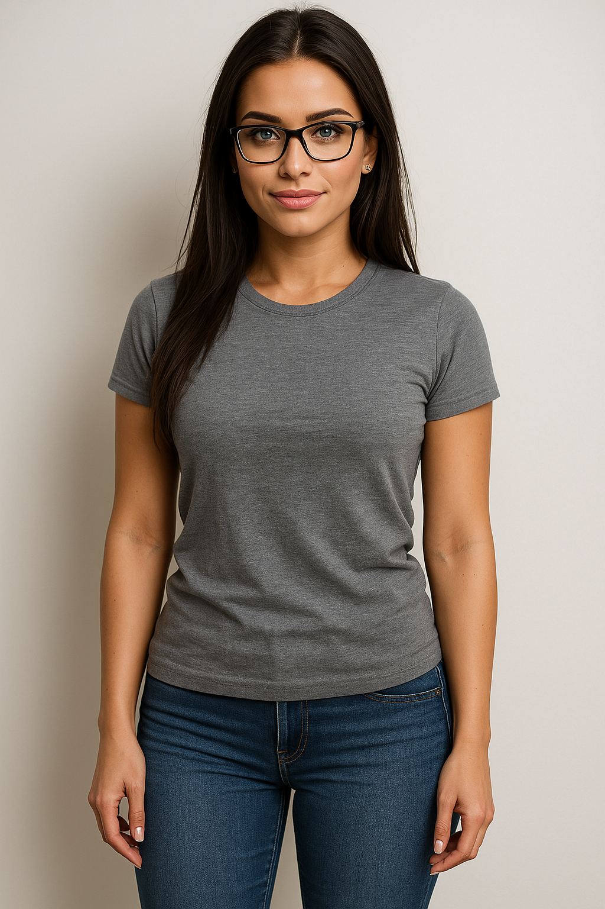

# 🧠 OllamaTools for ComfyUI

> *“To be honest, most LLM nodes in ComfyUI were just too complicated for me. Too many settings, too many possibilities.  
> So I built the kind of tools I wish I had when I started.”*

ComfyUI has powerful capabilities for working with local LLMs via [Ollama](https://ollama.com), but many existing nodes are complex (meainig they provide more options than I can comprehend), poorly documented, or difficult to use for newcomers, or to be honest, people like me

**This project makes local LLMs easy to use for prompt enhancement and image captioning –**  
No API keys. No external tools. No headache.

---

## 🧩 Included Nodes

### 🔹 Ollama Prompt Booster

Improves a basic text prompt using a local language model like Zephyr or DeepSeek.  
Turns short ideas into more vivid, descriptive prompts for text-to-image generation.

✅ Supports the following models:
- `zephyr:7b-beta`
- `deepseek-r1:8b`
- `llama3.2:latest`
- `mistral:latest`

---

### 🔹 Ollama Pic Describer

Takes an image and returns a prompt-like description.  
Great for `img2img`, ControlNet reruns, prompt recovery, or inspiration.  
Supports style options like `cinematic`, `poetic`, or `nsfw`.

✅ Supports the following models:
- `llava:latest`
- `moondream:latest`

---

## 🚀 Examples

### ✏️ Prompt Booster

Input:
```text
woman on a balcony, sunset, elegant
```

Output: (deepseek example)
```text 
A refined woman in an elegant, flowing dress stands gracefully on a balcony overlooking a bustling city at sunset. The warm, golden hues of the horizon paint the sky with streaks of pink and orange as the sun dips below the horizon. She holds a shawl softly billowing in the evening breeze, her posture one of poise and serenity as she gazes out over the city lights beginning to twinkle in the distance.
```

---

### 🖼️ Pic Describer

Given this image:  


Returns a prompt like:
```text
The image captures a moment of casual elegance. A woman stands confidently against a stark white wall, her posture relaxed yet poised. Her attire is simple yet striking: a gray t-shirt that hints at comfort, paired with blue jeans that add a touch of sophistication to the ensemble.

Her long hair cascades down, framing her face and adding a soft contrast to the image. She sports glasses, which give her an air of intellectualism. The glasses, along with her serious expression, suggest she's ready for whatever comes next.

The lighting in the image is soft and diffused, casting gentle shadows that add depth to the scene. The white wall serves as a neutral backdrop, allowing the subject to take center stage. The simplicity of the background puts the focus entirely on the woman, highlighting her presence in the frame.

Overall, the image exudes a sense of calm and readiness, as if the woman is preparing for an important event or meeting.
```
Settings in PIC description node for the above result: 
- model: llava
- style: cinematic
- prompt: Describe the image

---

## 💻 Installation

1. Install [Ollama](https://ollama.com) and make sure it's running locally
2. Clone this repo into your `ComfyUI/custom_nodes` folder:

```bash
git clone https://github.com/max-dingsda/OllamaTools.git
```

3. (Optional) Install Python dependencies:

```bash
pip install -r requirements.txt
```

4. Launch ComfyUI and start building!

---

## 🔧 Model Setup

You can pull the models you need with:

```bash
ollama pull zephyr:7b-beta
ollama pull deepseek-r1:8b
ollama pull llava:latest
ollama pull moondream:latest
```

Only models you're using need to be installed.

---

## 🧠 Requirements

- Python 3.10+
- ComfyUI
- Ollama (running locally)
- Python libraries:
  - `requests`
  - `Pillow`

---

## 🪪 License

MIT – use freely, contribute gladly, no need to pretend you wrote it 😉

---

## 💬 About

This project was built out of necessity – and some self-deprecating humor.  
I wanted LLM features that "just work" inside ComfyUI.

If you're the same: welcome aboard.
